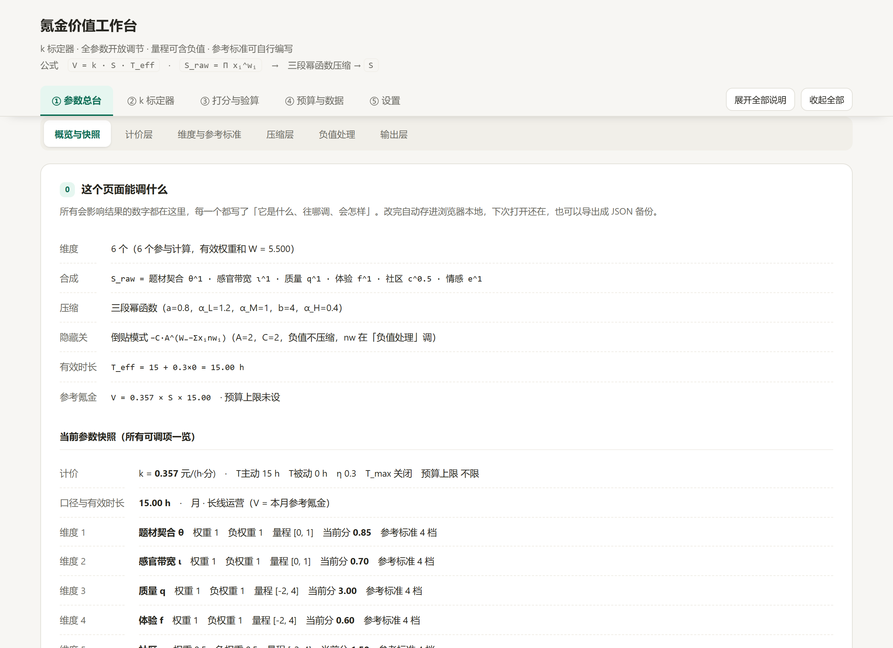
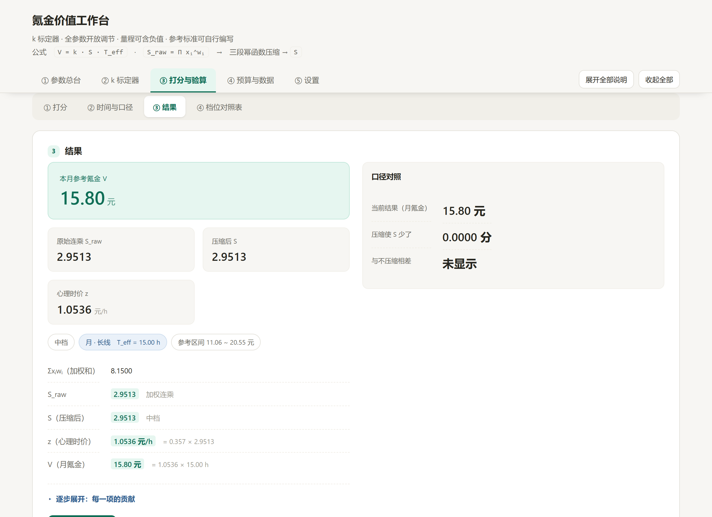

# 氪金价值工作台 (v0.1)

> **状态：实验性 / 低维护（维护不稳定）。** 最后更新：2026-09。
> 作者是编程新手，这个工具是自己在 AI 辅助下边学边做的，水平和精力都有限，做得不好的地方还请包涵。
> 本项目按「原样」提供，不保证可用性、安全性或后续更新；欢迎自行取用和改造，也欢迎提 issue / PR，但作者不保证回复或合并。
> 本工具不构成财务、消费或投资建议。
>
> **Status:** experimental / low-maintenance (unstable), made by a beginner. Provided "as is", without warranty of any kind. Issues and PRs are welcome, but no guarantee of response or merge.

---

## 这是什么

一个纯前端的「游戏氪金价值参考」小工具：按自己的口味给游戏打分，结合游玩时长，估算**这款游戏每月值多少钱 / 买断值多少钱**。结果只是作者自己用来参考的一个主观数字，不是什么客观标准，也不一定对。

- 核心公式：`V = k × S × T_eff`（S 为多维加权评分经压缩后的总分，T_eff 为折算后的有效时长，k 由自己的真实消费记录标定）
- 单文件 HTML，没有依赖、不联网，数据只存在本机浏览器里
- 界面和操作都只按电脑浏览器设计，目前仅面向电脑使用

## 一点想法（不是理论）

- **各维分数相乘**：0 是底线（毫无正面价值），1 是「一般」；任一维为 0 则整体为 0，短板决定上限。也允许打负分（极不喜欢的游戏会得到「倒贴才值得玩」的结果）。
- **不是「该花多少」，而是「值多少」**：算出来的是按自己的口味它值多少钱；花不花、花多少还是自己决定。
- **高档压缩**：越接近满分，边际价值递减，避免多维度相乘导致数值爆炸。
- **每个数字都能单独质疑**：结果拆成「体积（S）× 单价（k）× 时长（T_eff）」，哪一项不合直觉就调哪一项。

这些都是作者自己为了让结果合乎直觉而定的规矩，谈不上严谨的定价理论，参考即可。

## 截图

参数总台 · 概览（公式、参数快照全部可调）：



打分与验算 · 结果（每一步都能看到怎么算出来的）：



## 怎么用

1. 下载本仓库，直接双击打开 `app/www/index.html` 即可（用最新版 Chrome 或 Edge 比较稳）。
2. 第一次使用建议先在「① 参数总台 · 概览」点一次「导出全部数据」，留一份 JSON 备份。
3. 想改就改，代码很朴素，没有构建步骤，也没有依赖。

## 目录结构

```
├── README.md
├── LICENSE
├── docs/                       # README 用的截图
└── app/www/
    └── index.html              # 全部内容都在这一个文件里，双击即可打开
```

## 隐私与数据

- 不联网，也没有账号、统计和 Cookie；作者看不到任何使用数据。
- 数据只存在本机浏览器的 localStorage 里；清除浏览器数据、换设备或使用隐私模式都可能丢失。
- 建议偶尔备份一次：在「① 参数总台 · 概览」点「导出全部数据」存一份 JSON；需要恢复时，用同一处的「导入数据」选中该文件即可。

## 已知局限

- 作者是新手，代码和算法都可能有不严谨、不完善的地方，请自行判断再使用。
- k（时价系数）需要用真实消费记录自己标定；未标定时 k = 0，算不出金额。
- **不支持跨设备同步**，目前只适合单设备使用（可以手动导出 / 导入 JSON 在两台电脑之间搬运）。
- 未做专业安全审计；虽然完全离线、不联网，仍请自行评估。

## FAQ

- **为什么算不出金额（V = 0）？** k 还没标定。用「② k 标定器」按真实消费记录标定，或先用「④ 单游戏粗估」凭一款游戏快速估一个。
- **数据会丢吗？** 会。localStorage 不保险——清理浏览器数据、换设备、隐私模式都会丢，建议定期导出 JSON 备份。
- **能跨设备同步吗？** 暂不支持，只适合单设备使用。
- **能商用吗？** 见 [LICENSE](LICENSE)——MIT-0，没有附加限制。
- **支持哪些浏览器？** 只在最新版 Chrome / Edge 上试过，其他浏览器没验证。
- **能自己改吗？** 可以，随便改；只有一个 HTML 文件，没有构建步骤。

## 许可证与 Fork

本项目采用 **MIT-0（MIT No Attribution）**，全文见 [LICENSE](LICENSE)。

可以自由使用、复制、修改、改名、二次发布，**无署名要求**。欢迎 fork，也欢迎基于它做个更好用的版本；issue / PR 都可以提，但作者不保证回复或合并，这点还请谅解。

## 版本

- **v0.1**（2026-09）：首个公开实验版。参数总台 / k 标定 / 打分验算 / 额度账户 / 预算对账可用。

## 免责声明

本工具仅用于个人娱乐、学习与主观参考，**不构成财务、消费、投资或法律建议**。请理性消费。作者不对使用或无法使用本工具造成的任何损失负责。
